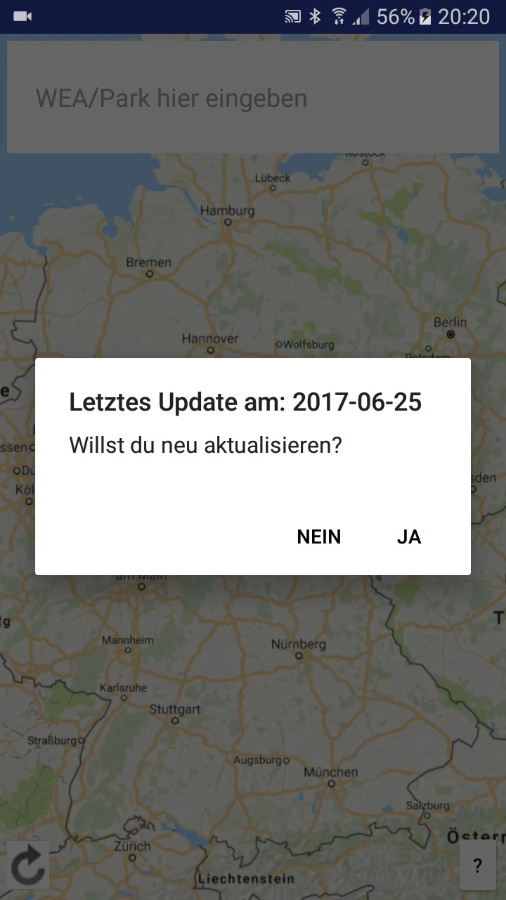
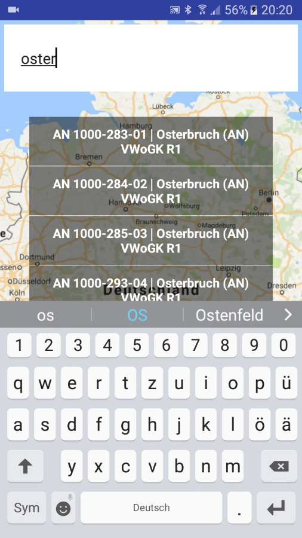
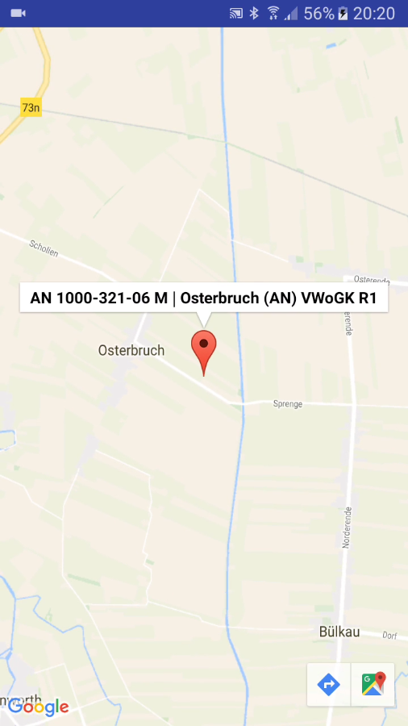

# Location-Finder
## Android Navigation App which uses Google Maps with a simple JSON/CSV database of locations

- The locations are in a CSV file, stored in the internal app directory. You can provide Your own file/s, and make the minor modification to the code, or use it as it is, providing some server to fetch the data (JSON) from.
- Clicking on the "Update" icon fetches the JSON/s from the server.
- Then the JSONs gets converted to local format (CSV).
- You can search for any word in the rows of data.
- Click on the arrow in the single view modus to open Google Map's real time navigation

I made this originally as a helper tool for me at work (service technician), to find not-yet-known-to-me wind turbines easily.

#### To build with Android Studio:

- create Your app/build.gradle
- insert Your google_maps_key in res/strings
- insert in MainActivity L.184-185 the server IP adress and route to the file/s

#### This project makes use of OpenCSV (http://opencsv.sourceforge.net/)
See it in action: [YouTube Video](https://youtu.be/fkMzzczyLYU)

